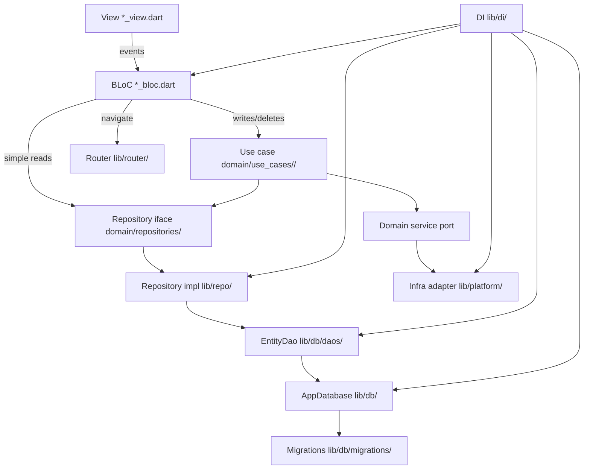

# Architecture — inStock

inStock is a mobile inventory app built with a layered architecture where the
domain is pure and every other layer depends inward. Import boundaries are
enforced by tests — see [enforcement.md](enforcement.md).

## Product features

Business purpose and inventory features (materials, presets,
availability, workbench reservations) are documented in
[product-overview.md](product-overview.md). Per-feature implementation specs:

| Feature | Spec |
|---------|------|
| Materials inventory | [inventory-design-spec.md](inventory-design-spec.md) |
| Presets | [presets-design-spec.md](presets-design-spec.md) |
| Workshop / workbench | [workshop-design-spec.md](workshop-design-spec.md) |
| Archive | [archive-design-spec.md](archive-design-spec.md) |
| Settings / theme / locale | [settings-design-spec.md](settings-design-spec.md) |

**Naming:** *Presets* are BOM/recipe definitions. *Theme presets* are
cocktail-named color schemes — see [Theming](#theming) below.

## Layers

Order layers from innermost (most pure, fewest dependencies) to outermost.

| Layer | Directory | Responsibility | May depend on |
|-------|-----------|----------------|---------------|
| Domain | `lib/domain/` | Entities, models, repository interfaces, service ports, use cases (grouped by entity/function under `use_cases/`), formatters, validators. Pure — no framework. | (nothing internal) |
| Data-access | `lib/repo/` | Repository implementations that fulfil domain interfaces. | Domain, DB |
| Persistence | `lib/db/` | Connection (`AppDatabase`), schema, migrations, DAOs — one DAO per table/aggregate. | Domain |
| Infra adapters | `lib/platform/` | OS/plugin adapters implementing domain service ports. | Domain |
| Presentation | `lib/screens/` | Views + BLoCs. Views render; BLoCs hold logic. One directory per screen (Freezed event/state + view). | Domain, router, di, theme |
| Cross-cutting | `lib/router/`, `lib/di/`, `lib/theme/`, `lib/l10n/` | Routing, dependency injection, design tokens, user-facing strings (ARB). | Domain + presentation as needed |

## Core rules

1. **BLoC** performs writes/deletes through a **use case** and simple reads
   through a **repository interface**.
2. **All navigation happens in BLoCs** — never in views or shared widgets.
   Every screen must be registered with a route in `lib/router/`. Views only
   dispatch events (e.g. `backTapped`); the BLoC navigates by calling helpers
   on `appRouter` (`go_router`) — e.g. `goToShellTab`, `pushArchive`,
   `pushPresetDetail`, `pushProductDetail`, `popRoute` — without
   importing `package:go_router` in the BLoC. Views must not import the router
   or `go_router`. Local dialog/sheet dismiss may use `Navigator.pop` with a
   one-line comment that route-level nav is BLoC-owned.
3. **No infrastructure in BLoC or views** — infrastructure is reached only
   through domain ports implemented in `lib/platform/` / `lib/repo/`.
4. **The domain is pure** — it must not import any outer layer or framework.
5. **API HTTP calls** (not implemented yet — app is local SQLite only) will be
   made from `lib/repo/` or `lib/platform/` (not from BLoCs/views). When a
   shared HTTP client is introduced, completion logging (`Success …` /
   `Failed …`; `logger.i` / `logger.w`) applies — see AGENTS.md for format.
   Temporary diagnostic logs: `logger.d` only — remove before finishing.
6. **User-facing copy lives in l10n** — views resolve strings via
   `AppLocalizations.of(context)` (generated from `lib/l10n/*.arb`). BLoCs and
   the domain layer must not contain UI copy; pass error codes or domain types
   and let views translate. Screen state may reuse the existing
   `errorMessage` field to hold stable codes from `UiErrorCodes` (not English
   and never `exception.toString()`); views map codes (and typed flags) to
   `AppLocalizations` in `BlocListener`s.
7. **Freezed for screen event/state** — after editing annotated sources, run
   `dart run build_runner build --delete-conflicting-outputs`. Do not hand-edit
   `*.freezed.dart`.

## Logger setup

Centralize the `logger` package in `lib/logger/logger.dart`. Configure
`PrettyPrinter` with a short stack trace from the log call site:

```dart
import 'package:logger/logger.dart';

final logger = Logger(
  printer: PrettyPrinter(
    methodCount: 1,
    errorMethodCount: 1,
    lineLength: 120,
  ),
);
```

## Strict import table

This is the authoritative deny-list. For each file group, list the import
prefixes it must **not** contain. The lint-rules class and architecture test
encode exactly this table.

- **`lib/domain/**`** must not import: Flutter, `lib/screens/`, `lib/repo/`,
  `lib/db/`, `lib/platform/`, `lib/router/`, `lib/di/`, `lib/theme/`,
  flutter_bloc, go_router.
- **`lib/repo/**`** must not import: Flutter widgets, `lib/screens/`,
  `lib/router/`, `lib/di/`, flutter_bloc, go_router.
- **`lib/db/**`** must not import: Flutter widgets, `lib/screens/`,
  `lib/repo/`, `lib/router/`, `lib/di/`, flutter_bloc, go_router.
- **`lib/platform/**`** must not import: `lib/screens/`, `lib/repo/`,
  `lib/db/`, `lib/router/`, `lib/di/`, flutter_bloc, go_router.
- **Views (`*_view.dart`) and other presentation helpers under
  `lib/screens/`** (everything outside `components/` and generated
  `*.freezed.dart` / `*.g.dart` — e.g. `lib/screens/errors/`) must not import:
  `lib/repo/`, `lib/db/`, `lib/router/`, `lib/di/`, go_router.
- **Controllers (`*_bloc.dart` / `*_event.dart` / `*_state.dart`)** must not
  import: `lib/repo/`, `lib/db/`, go_router, or infrastructure plugins
  (sqflite, http, path_provider, image_picker, shared_preferences).
- **Shared components (`lib/screens/components/**`)** must not import:
  `lib/repo/`, `lib/db/`, `lib/router/`, `lib/di/`, flutter_bloc, go_router.

## Data flow



Domain interfaces (`Repo`, `Port`, `UseCase`) live in the domain layer;
`RepoImpl` and `Platform` implement them from outer layers and are wired in
`lib/di/`. Repository impls call **DAOs** (not raw database handles); DAOs
return domain entities directly.

## Remote DTOs

**Not implemented.** The app is local-only (SQLite). When remote APIs are
added, JSON DTOs (`json_serializable`) belong in the repo/HTTP path and must
map to domain entities before crossing into controllers. DAOs continue to own
SQL and return domain entities — see
[agent-guidelines/03-serialization.md](agent-guidelines/03-serialization.md).

### Persistence layout (`lib/db/`)

```
lib/db/
├── app_database.dart       # SQLite connection, version, transaction()
├── schema/tables.dart      # CREATE TABLE DDL
├── migrations/             # incremental upgrade steps
└── daos/<entity>_dao.dart  # one DAO per table — SQL CRUD
```

Inventory tables (v1): `materials`, `presets`, `preset_materials`,
`products`, `used_materials`. Indexes: `used_materials(material_id)`,
`used_materials(product_id)`, `preset_materials(preset_id)`,
`products(state, updated_at)`. Domain entities map 1:1; workbench builds snapshot
preset display fields and BOM lines at creation time. `products.updated_at`
records the last update timestamp; finishing a build sets it to the finish time
and the archive screen filters finished products by that range. `materials.image`
and `presets.image` store optional local filesystem paths. Deleting a
material removes its preset BOM lines (`preset_materials`); deletion is blocked
with `MaterialInUseException` while the material is reserved on an active
workbench build (`used_materials`). Deleting a preset cascades its BOM
lines and is allowed while products still reference it — products keep
snapshotted `preset_name` / `preset_description` (and an historical
`preset_id` with no FK). **Schema version 1 is the intentionally folded
development schema** (migration v1 applies `createSchemaStatements`). Historical
development databases at v2–v6 are unsupported; those installs recover only
through the user-confirmed wipe flow. While the app is still in development,
prefer folding schema into the current `CREATE TABLE` statements when practical;
use incremental migrations in `lib/db/migrations/` when upgrading an existing
install is required. Fresh installs and wipe recovery run migrations from
version 0 (migration v1 applies `createSchemaStatements`).

Repository interfaces live in `lib/domain/repositories/`; implementations in
`lib/repo/`. Write/delete operations use domain use cases in
`lib/domain/use_cases/` (grouped by entity/function).

- **`AppDatabase`** — open/close, `onCreate`/`onUpgrade` (both via
  `runMigrations`), `wipeAndRecreate()` (delete DB file then reopen so
  migrations rebuild schema from v1), `transaction()` / `withDb` /
  `withExecutor` for cross-DAO writes and guarded queries. Failures are
  wrapped as domain `DatabaseException` via `guardDatabase` /
  `guardDatabaseOpen` (SQLite errors only for queries/transactions; open also
  wraps unexpected IO failures). Domain exceptions such as
  `MaterialInUseException` propagate unchanged. No per-table queries.
- **`DatabaseBootstrapStatus`** — registered in DI after open: `ready` on
  success, `failed(cause)` when open throws. Startup continues either way so
  `runApp` still runs; `HomeBloc` reads this on start and emits
  `databaseOpenFailure` when not ready. Home shows a recovery dialog: retry
  (`RetryDatabaseUseCase` → `retryOpen`) or wipe (confirm →
  `WipeDatabaseUseCase` → `wipeAndRecreate`). Both paths go through
  `DatabaseMaintenanceRepository`. On open, `AppDatabase` retains
  `pathOverride` (or the last resolved path) so retries reuse the same file.
- **`<Entity>Dao`** — table-specific SELECT/INSERT/UPDATE/DELETE via
  `withExecutor`; maps query results to domain entities.
- **Repository impls** — the only callers of DAOs. (Future: may combine local
  DAO data with remote HTTP responses when a client exists.)

### Read path (example)

1. BLoC calls `MaterialRepository.getById(id)` (domain interface).
2. `MaterialRepositoryImpl` calls `MaterialDao.findById(id)` → domain `Material`.
3. BLoC receives domain type only.

### Write path (example)

1. BLoC dispatches to `CreateOrUpdateMaterialUseCase`.
2. Use case calls `MaterialRepository.save(material)`.
3. `MaterialRepositoryImpl` calls `MaterialDao.upsert(material)`.
4. Cross-table write: `AppDatabase.transaction(...)` with DAOs receiving the
   transactional handle.

**Dev seeding:** Settings exposes a **Seed database** action (developer section)
that runs `SeedDatabaseUseCase` — clears inventory tables, inserts dummy
materials/presets/BOM lines, and adds one workbench build via
`AddProductToWorkbenchUseCase`. Implementation: `DatabaseSeederRepository` in
domain, `DatabaseSeederRepositoryImpl` in `lib/repo/`, seed payloads in
`lib/domain/seed/dummy_seed_data.dart`.

### Example snippets

`lib/db/app_database.dart` — SQLite via sqflite:

```dart
class AppDatabase {
  static const version = 1;

  Future<Database> open({String? pathOverride}) async { ... }
  Future<void> wipeAndRecreate({String? pathOverride}) async { ... }
  Future<void> close() async { ... }
  Future<T> withDb<T>(Future<T> Function(Database db) action) { ... }
  Future<T> withExecutor<T>(
    DatabaseExecutor? db,
    Future<T> Function(DatabaseExecutor executor) action,
  ) { ... }
  Future<T> transaction<T>(Future<T> Function(Transaction txn) action) { ... }
}
```

`lib/di/di.dart` — split registration into private helpers
(`_registerSingletons`, `_registerUseCases`, `_registerScreens`, …), group
entries with section comments (e.g. `// inventory use cases`), and call those
helpers from one public startup method run from `main` before `runApp`. Inside
`_registerSingletons`, order is AppDatabase → open (catch →
`DatabaseBootstrapStatus`) → DAOs → repository impls / platform adapters:

```dart
Future<void> configureDependencies() async {
  _registerSingletons();
  _registerUseCases();
  _registerScreens();
}

void _registerSingletons() {
  // database
  getIt.registerLazySingleton<AppDatabase>(() => AppDatabase());
  // open + DatabaseBootstrapStatus.ready / .failed
  getIt.registerLazySingleton<MaterialDao>(() => MaterialDao(getIt()));

  // inventory repos
  getIt.registerLazySingleton<MaterialRepository>(
    () => MaterialRepositoryImpl(getIt()),
  );
}

void _registerUseCases() {
  // inventory use cases
  getIt.registerLazySingleton(() => CreateOrUpdateMaterialUseCase(getIt()));
}

void _registerScreens() {
  // inventory screens
  getIt.registerFactory(() => InventoryBloc(getIt()));
}
```

## Theming

- Preset IDs live in `lib/domain/models/theme_preset_id.dart` (pure Dart).
- **Every preset must be named after a cocktail** (e.g. `cosmopolitan`).
  Use camelCase enum values derived from the cocktail name.
- `ThemePreferencesRepository` (domain) persists the selected preset; impl in
  `lib/platform/` via `shared_preferences`.
- `AppThemeCubit` in `lib/theme/` maps preset → `ThemeData` and drives
  `MaterialApp.theme`. System dark mode is ignored; dark UI requires a
  dark-category preset. Preset colors are hand-authored `ColorScheme` values
  in `lib/theme/app_theme_presets.dart` (not `ColorScheme.fromSeed`).
- Views use `Theme.of(context)` and shared tokens (`AppSpacing`, `AppRadius`).
  Settings calls `AppThemeCubit.selectPreset` from the theme panel.

**Current presets:**

| ID | Category | Notes |
|----|----------|-------|
| `cosmopolitan` | light | Hand-authored pink/rose palette (default) |
| `pinaColada` | light | Hand-authored teal/cream palette |
| `whiteRussian` | light | Hand-authored black/white monochrome palette |
| `chartreuse` | dark | Hand-authored gold-on-forest palette |
| `blueHawaii` | dark | Hand-authored coral-on-blue palette |
| `oldFashioned` | dark | Hand-authored amber-on-charcoal palette |

## Locale preferences

- Option IDs live in `lib/domain/models/app_locale_option.dart` (`english`,
  `german`). Legacy `system` storage keys migrate to `english`.
- `LocalePreferencesRepository` (domain) persists the selected option; impl in
  `lib/platform/` via `shared_preferences`.
- `AppLocaleCubit` in `lib/theme/` drives `MaterialApp.locale` (`Locale('en')`
  or `Locale('de')`).
- Settings calls `AppLocaleCubit.cycleLocale` from the language cycle button.

## Changing a boundary

A boundary change is a three-file change, all in the same commit:

1. Update the **Strict import table** above.
2. Update the deny-lists in `lint_rules/lib/layer_import_rules.dart` (see
   [enforcement.md](enforcement.md)).
3. Update / re-run `test/architecture/layer_import_test.dart`.

If they disagree, the table wins and the other two are bugs.

## Internationalization (`lib/l10n/`)

User-facing strings are defined in ARB files and resolved in views only.

| File | Role |
|------|------|
| `lib/l10n/app_en.arb` | Template locale (English) — add new keys here first |
| `lib/l10n/app_<locale>.arb` | Translations for each supported locale (e.g. `app_de.arb`) |
| `lib/l10n/app_localizations*.dart` | Generated by `flutter gen-l10n` — do not edit by hand |

Configuration lives in `l10n.yaml` at the project root. After changing ARB files, run
`flutter gen-l10n` (or any build/analyze that triggers code generation).

In views:

```dart
import 'package:instock/l10n/app_localizations.dart';

final l10n = AppLocalizations.of(context);
Text(l10n.homeWelcome);
```

`MaterialApp` wires delegates in `lib/main.dart` via
`AppLocalizations.localizationsDelegates` and `AppLocalizations.supportedLocales`.
`AppLocaleCubit` sets `MaterialApp.locale` to English or German.
