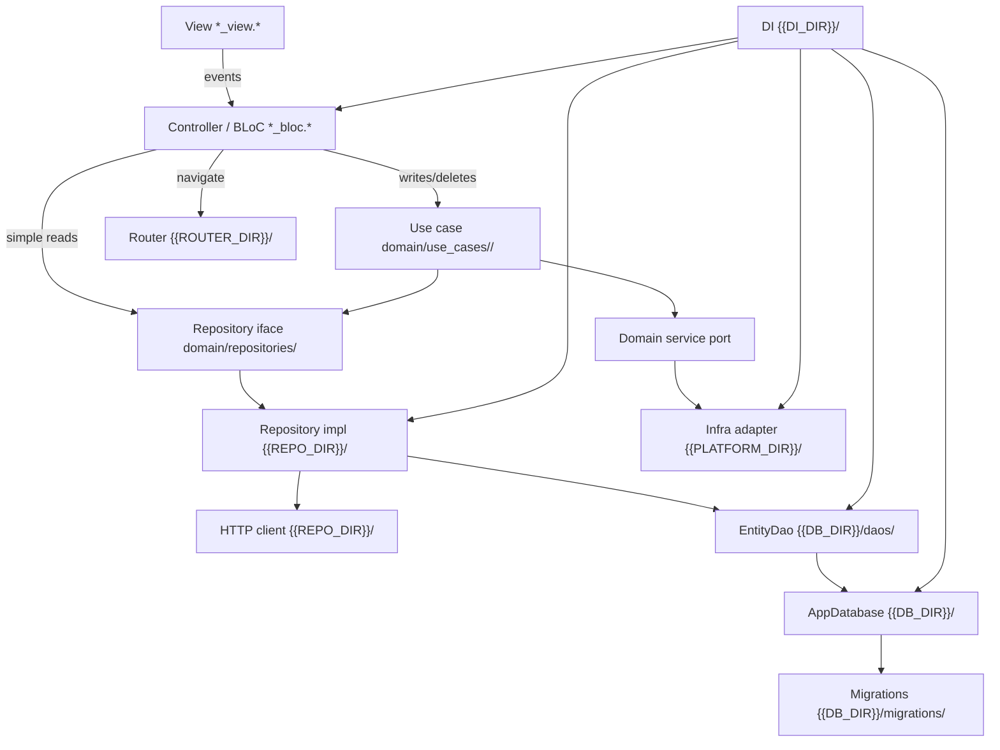

<!--
  TEMPLATE — copy to docs/architecture.md and fill in the {{PLACEHOLDERS}}.
  This document is the single source of truth for the dependency graph. The
  lint-rules class and the architecture test (see enforcement.md) mirror the
  "Strict import table" below. Keep all three in sync.
  inStock’s filled copy is docs/architecture.md.
-->

# Architecture — {{PROJECT_NAME}}

{{ONE_PARAGRAPH: what the app is and the guiding principle — e.g. "a layered
architecture where the domain is pure and every other layer depends inward."}}

## Layers

Order layers from innermost (most pure, fewest dependencies) to outermost.

| Layer | Directory | Responsibility | May depend on |
|-------|-----------|----------------|---------------|
| Domain | `{{DOMAIN_DIR}}` | Entities, models, repository interfaces, service ports, use cases (grouped by entity/function under `use_cases/`), formatters, validators. Pure — no framework. | (nothing internal) |
| Data-access | `{{REPO_DIR}}` | Repository implementations that fulfil domain interfaces. | Domain, DB |
| Persistence | `{{DB_DIR}}` | Connection (`AppDatabase`), schema, migrations, DAOs — one DAO per table/aggregate. | Domain |
| Infra adapters | `{{PLATFORM_DIR}}` | OS/plugin adapters implementing domain service ports. | Domain |
| Presentation | `{{SCREENS_DIR}}` | Views + state/controllers (BLoCs). Views render; controllers hold logic. One directory per screen (Freezed event/state + view). | Domain, {{router}}, {{di}}, {{theme}} |
| Cross-cutting | `{{ROUTER_DIR}}`, `{{DI_DIR}}`, `{{THEME_DIR}}` | Routing, dependency injection, design tokens. | Domain + presentation as needed |

## Core rules

1. **{{STATE/CONTROLLER}}** performs writes/deletes through a **{{WRITE_UNIT}}**
   and simple reads through a **{{READ_UNIT}}**.
2. **All navigation happens in BLoCs / {{STATE/CONTROLLER}}** — never in
   views or shared widgets. Every screen must be registered with a route in
   `{{ROUTER_DIR}}`. Views only dispatch events (e.g. `backTapped`); the BLoC
   navigates by calling `{{ROUTER}}` with that registered route. Views must
   not import the router or navigation package.
3. **No {{INFRASTRUCTURE}} in {{STATE/CONTROLLER}} or views** — infrastructure is
   reached only through domain ports implemented in `{{PLATFORM_DIR}}` /
   `{{REPO_DIR}}`.
4. **The domain is pure** — it must not import any outer layer or framework.
5. **API HTTP calls** are made from `{{REPO_DIR}}` or `{{PLATFORM_DIR}}` (not
   from controllers/views). Completion logging is centralized in the shared HTTP
   client — see AGENTS.md for format (`Success …` / `Failed …`; `logger.i` /
   `logger.w`). Temporary diagnostic logs: `logger.d` only — remove before
   finishing.
6. **Freezed for screen event/state** — after editing annotated sources, run
   `dart run build_runner build --delete-conflicting-outputs`. Do not hand-edit
   `*.freezed.dart`.

## Logger setup

Centralize the `logger` package in `lib/logger/logger.*`. Configure
`PrettyPrinter` with a short stack trace from the log call site:

```dart
import 'package:logger/logger.dart';

final logger = Logger(
  printer: PrettyPrinter(
    methodCount: 1,
    errorMethodCount: 1,
    lineLength: 120,
  ),
);
```

## Strict import table

This is the authoritative deny-list. For each file group, list the import
prefixes it must **not** contain. The lint-rules class and architecture test
encode exactly this table.

- **`{{DOMAIN_DIR}}/**`** must not import: {{framework}}, `{{SCREENS_DIR}}`,
  `{{REPO_DIR}}`, `{{DB_DIR}}`, `{{PLATFORM_DIR}}`, `{{ROUTER_DIR}}`,
  `{{DI_DIR}}`, `{{THEME_DIR}}`, {{state-management framework}}.
- **`{{REPO_DIR}}/**`** must not import: {{framework}}, `{{SCREENS_DIR}}`,
  `{{ROUTER_DIR}}`, `{{DI_DIR}}`, {{state-management framework}}.
- **`{{DB_DIR}}/**`** must not import: {{framework}}, `{{SCREENS_DIR}}`,
  `{{REPO_DIR}}`, `{{ROUTER_DIR}}`, `{{DI_DIR}}`, {{state-management framework}}.
- **`{{PLATFORM_DIR}}/**`** must not import: `{{SCREENS_DIR}}`, `{{REPO_DIR}}`,
  `{{DB_DIR}}`, `{{ROUTER_DIR}}`, `{{DI_DIR}}`, {{state-management framework}}.
- **Views (`*_view.*`)** must not import: `{{REPO_DIR}}`, `{{DB_DIR}}`,
  `{{ROUTER_DIR}}`, `{{DI_DIR}}`, {{navigation package}}.
- **Controllers (`*_bloc.*` / `*_event.*` / `*_state.*`)** must not import:
  `{{REPO_DIR}}`, `{{DB_DIR}}`, {{navigation package}}, {{infrastructure plugins}}.
- **Shared components** must not import: `{{REPO_DIR}}`, `{{DB_DIR}}`,
  `{{ROUTER_DIR}}`, `{{DI_DIR}}`, {{state-management framework}}, {{navigation package}}.

## Data flow



Domain interfaces (`Repo`, `Port`, `UseCase`) live in the domain layer;
`RepoImpl` and `Platform` implement them from outer layers and are wired in
`{{DI_DIR}}`. Repository impls call **DAOs** (not raw `Database`); DAOs return
domain entities directly.

## Remote DTOs

JSON DTOs (`json_serializable`) belong in the repo/HTTP path. Map to domain
entities before crossing into controllers. DAOs continue to own SQL and return
domain entities — see `docs/agent-guidelines/03-serialization.md`.

### Persistence layout (`{{DB_DIR}}/`)

```
{{DB_DIR}}/
├── app_database.*          # connection, version, transaction()
├── schema/tables.*         # CREATE TABLE DDL
├── migrations/             # incremental upgrade steps
└── daos/<entity>_dao.*     # one DAO per table — SQL CRUD
```

- **`AppDatabase`** — open/close, `onCreate`/`onUpgrade`, `transaction()` for
  cross-DAO writes. No per-table queries.
- **`<Entity>Dao`** — table-specific SELECT/INSERT/UPDATE/DELETE; maps query
  results to domain entities.
- **Repository impls** — the only callers of DAOs; may combine local DAO data
  with remote HTTP responses.

### Read path (example)

1. BLoC calls `ReminderRepository.getById(id)` (domain interface).
2. `ReminderRepositoryImpl` calls `ReminderDao.findById(id)` → domain `Reminder`.
3. Impl may merge remote data via HTTP before returning.
4. BLoC receives domain type only.

### Write path (example)

1. BLoC dispatches to `CreateOrUpdateReminderUseCase`.
2. Use case calls `ReminderRepository.save(reminder)`.
3. `ReminderRepositoryImpl` calls `ReminderDao.upsert(reminder)`.
4. Cross-table write: `AppDatabase.transaction((db) async { ... })` with DAOs
   receiving the transactional `db` handle.

### Example snippets

`di/di.*` — split registration into private helpers (`_registerSingletons`,
`_registerUseCases`, `_registerScreens`, …), group entries with section
comments, and call those helpers from one public startup method run from
`main` before `runApp`.

## Changing a boundary

A boundary change is a three-file change, all in the same commit:

1. Update the **Strict import table** above.
2. Update the deny-lists in `{{LINT_RULES_PACKAGE}}` (see
   [enforcement.md](enforcement.md)).
3. Update / re-run `{{ARCHITECTURE_TEST_PATH}}`.

If they disagree, the table wins and the other two are bugs.
